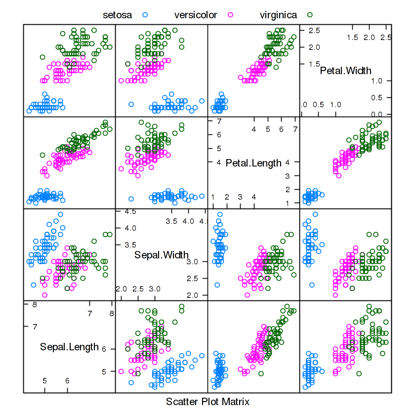
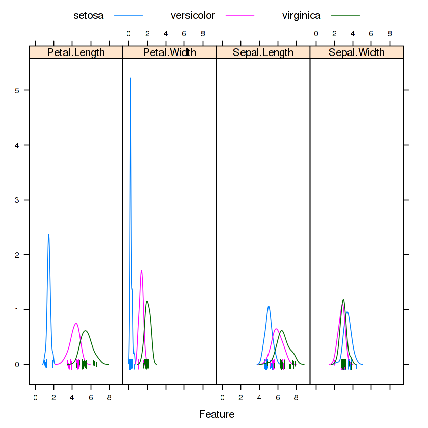
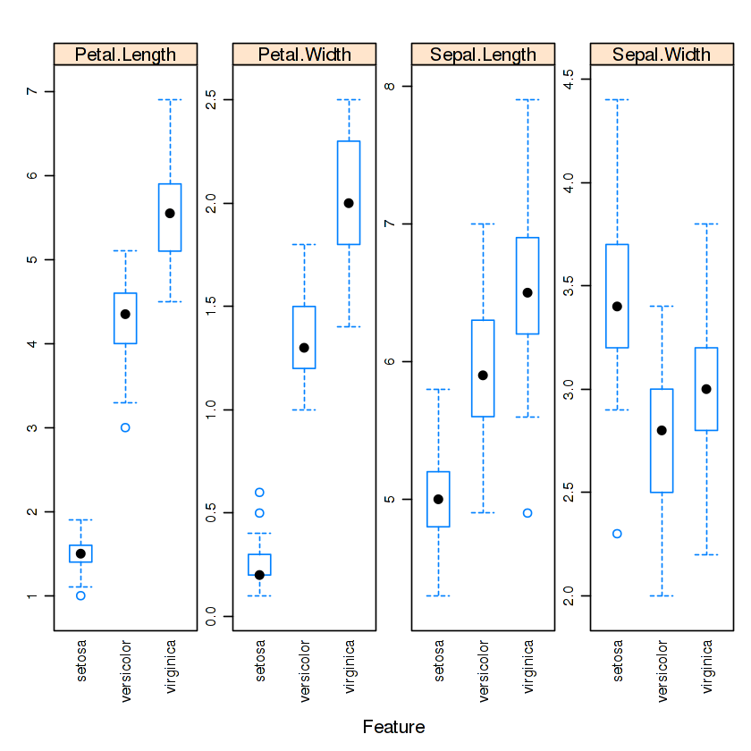
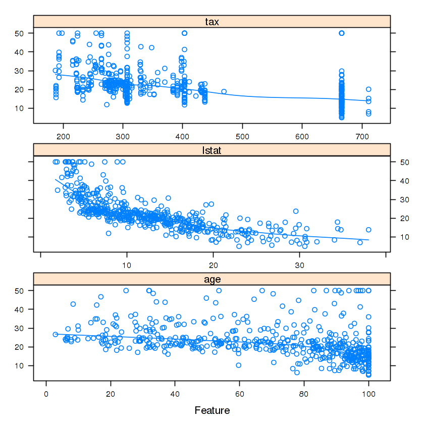

```R
str(iris)
```

    'data.frame':	150 obs. of  5 variables:
     $ Sepal.Length: num  5.1 4.9 4.7 4.6 5 5.4 4.6 5 4.4 4.9 ...
     $ Sepal.Width : num  3.5 3 3.2 3.1 3.6 3.9 3.4 3.4 2.9 3.1 ...
     $ Petal.Length: num  1.4 1.4 1.3 1.5 1.4 1.7 1.4 1.5 1.4 1.5 ...
     $ Petal.Width : num  0.2 0.2 0.2 0.2 0.2 0.4 0.3 0.2 0.2 0.1 ...
     $ Species     : Factor w/ 3 levels "setosa","versicolor",..: 1 1 1 1 1 1 1 1 1 1 ...


```R
library(caret)
featurePlot(x = iris[, 1:4], 
            y = iris$Species, 
            plot = "pairs",
            ## Add a key at the top
            auto.key = list(columns = 3))
```

    Loading required package: lattice
    Loading required package: ggplot2





```R
featurePlot(x = iris[, 1:4], 
            y = iris$Species,
            plot = "density", 
            layout = c(4, 1), 
            pch = "|", 
            adjust = 1.5, 
            auto.key = list(columns = 3))
```





```R
featurePlot(x = iris[, 1:4], 
            y = iris$Species, 
            plot = "box", 
            ## Pass in options to bwplot() 
            scales = list(y = list(relation="free"),
                          x = list(rot = 90)),  
            layout = c(4,1 ), 
            auto.key = list(columns = 2))
```





```R
library(mlbench)
data(BostonHousing)
regVar <- c("age", "lstat", "tax")
str(BostonHousing[, regVar])
```

    'data.frame':	506 obs. of  3 variables:
     $ age  : num  65.2 78.9 61.1 45.8 54.2 58.7 66.6 96.1 100 85.9 ...
     $ lstat: num  4.98 9.14 4.03 2.94 5.33 ...
     $ tax  : num  296 242 242 222 222 222 311 311 311 311 ...


```R
featurePlot(x = BostonHousing[, regVar], 
            y = BostonHousing$medv, 
            plot = "scatter",
            type = c("p", "smooth"),
            span = .5,
            layout = c(1, 3))
```





```R

```
