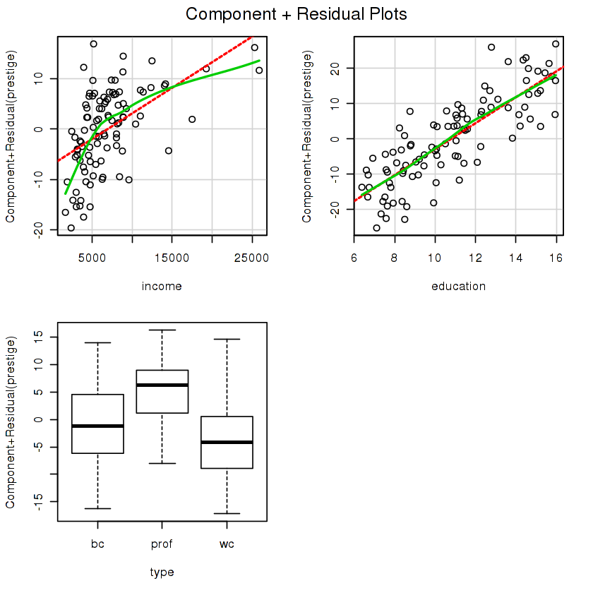
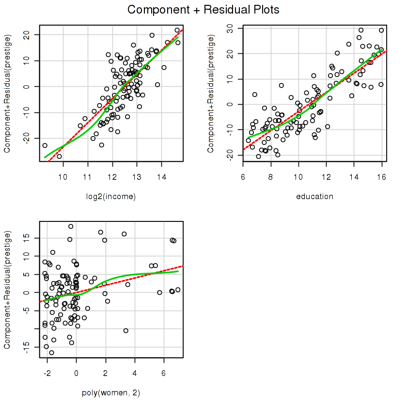
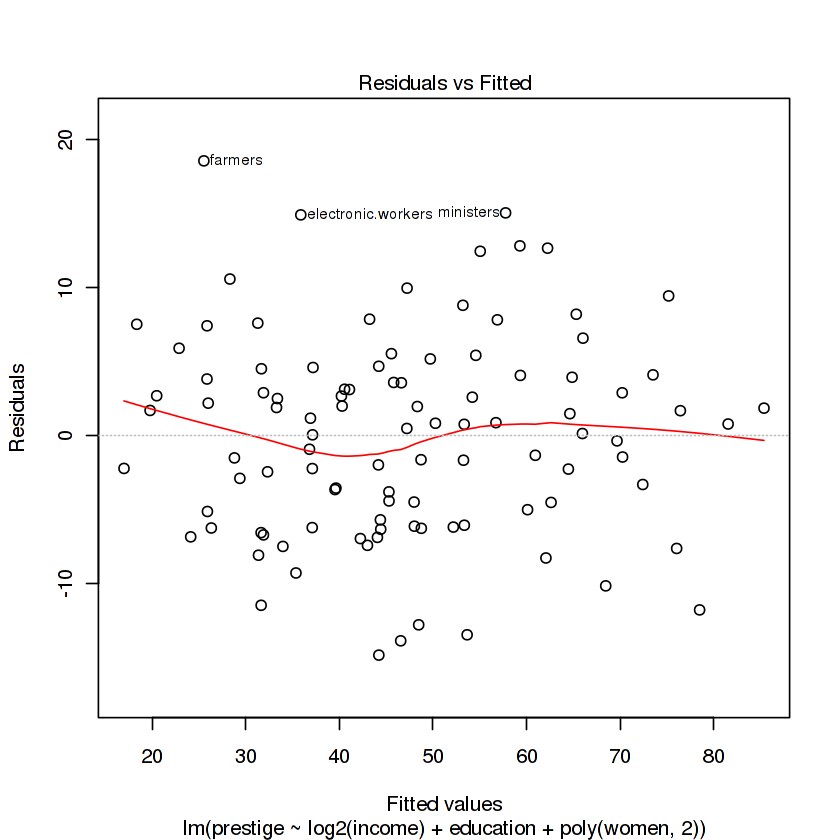
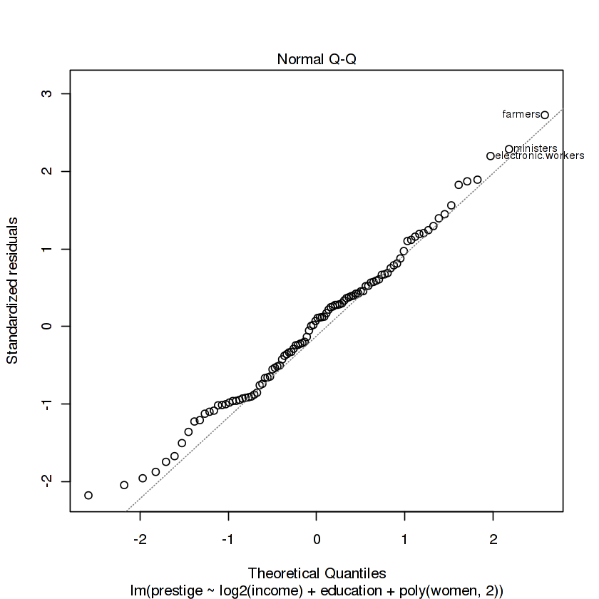
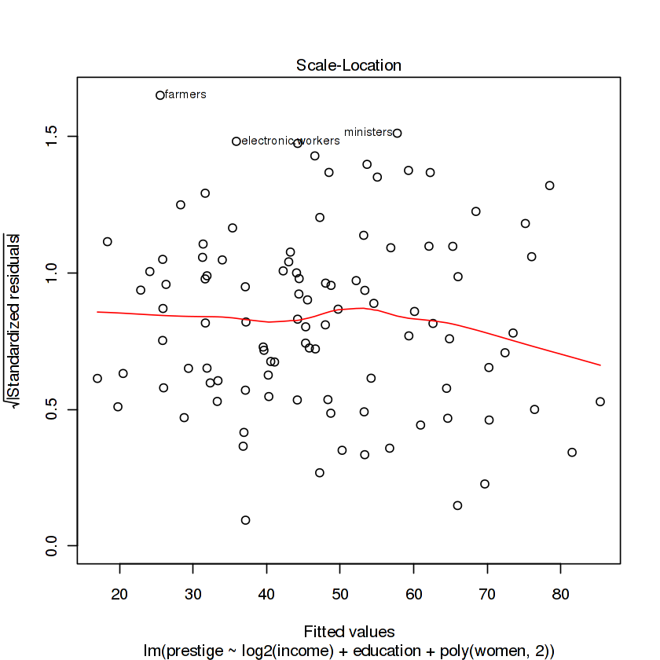
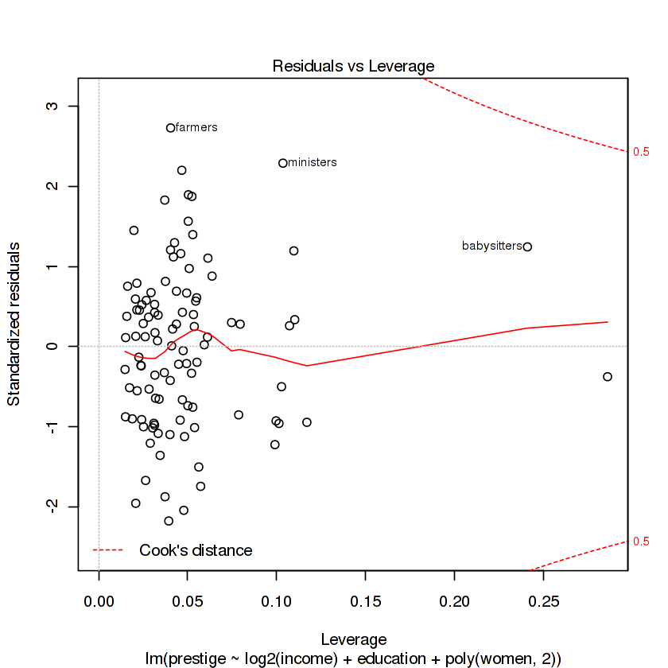
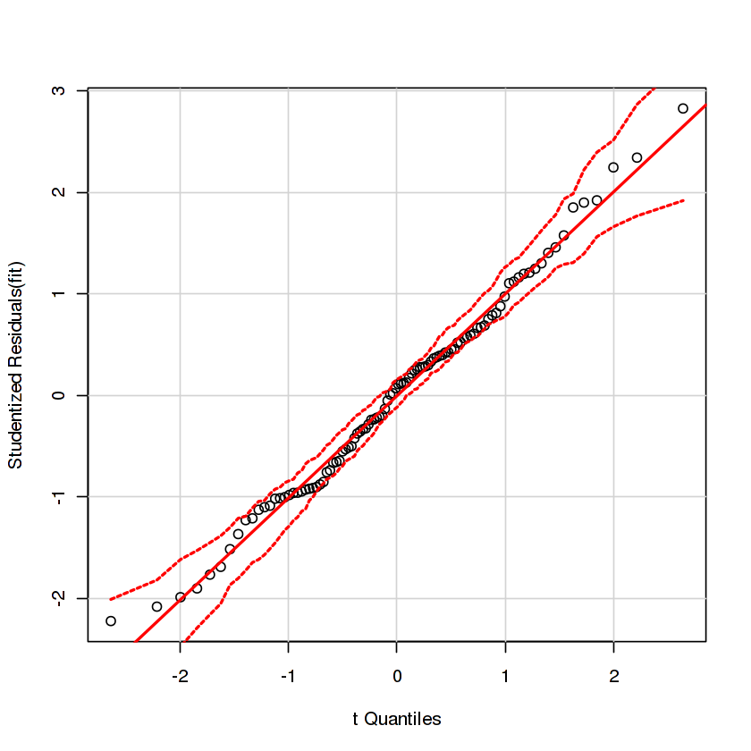
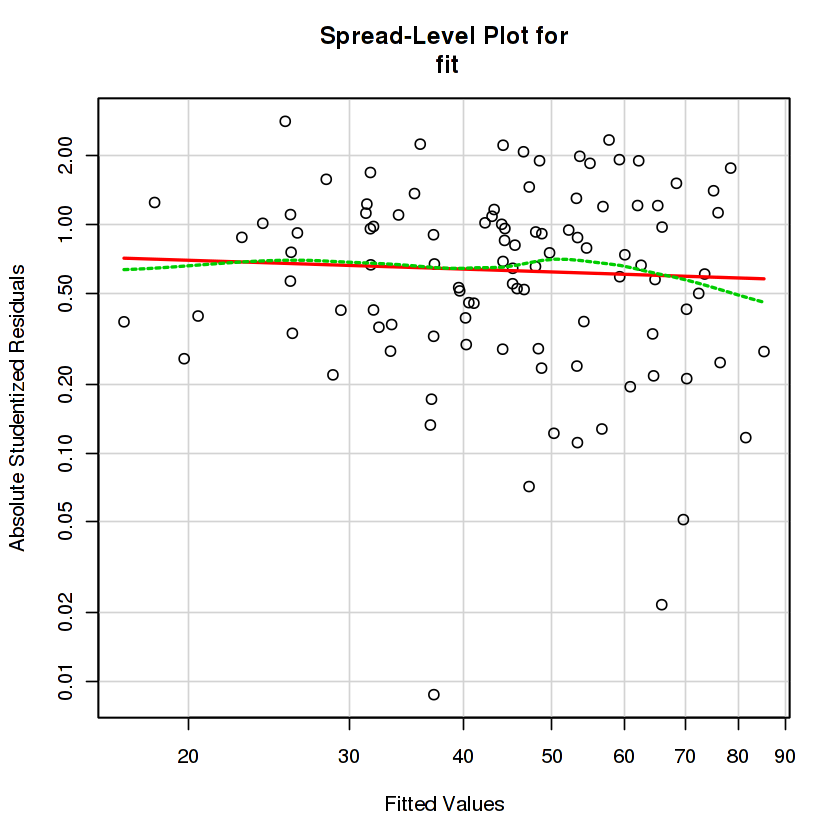

https://www.jianshu.com/p/464bd93c3410
linear regression  诊断


```R
library(car)

str(Prestige)
#线性
crPlots(m<-lm(prestige ~ income + education+type, data=Prestige)) 

crPlots(lm(prestige ~ log2(income) + education +poly(women,2), data=Prestige))
fit<-lm(prestige ~ log2(income) + education +poly(women,2), data=Prestige)
plot(fit)
```

    'data.frame':	102 obs. of  6 variables:
     $ education: num  13.1 12.3 12.8 11.4 14.6 ...
     $ income   : int  12351 25879 9271 8865 8403 11030 8258 14163 11377 11023 ...
     $ women    : num  11.16 4.02 15.7 9.11 11.68 ...
     $ prestige : num  68.8 69.1 63.4 56.8 73.5 77.6 72.6 78.1 73.1 68.8 ...
     $ census   : int  1113 1130 1171 1175 2111 2113 2133 2141 2143 2153 ...
     $ type     : Factor w/ 3 levels "bc","prof","wc": 2 2 2 2 2 2 2 2 2 2 ...




















正态


```R
qqPlot(fit)
```





同方差检验


```R
ncvTest(fit)
```


```R
spreadLevelPlot(fit)
```


    
    Suggested power transformation:  1.128704 





```R

```
